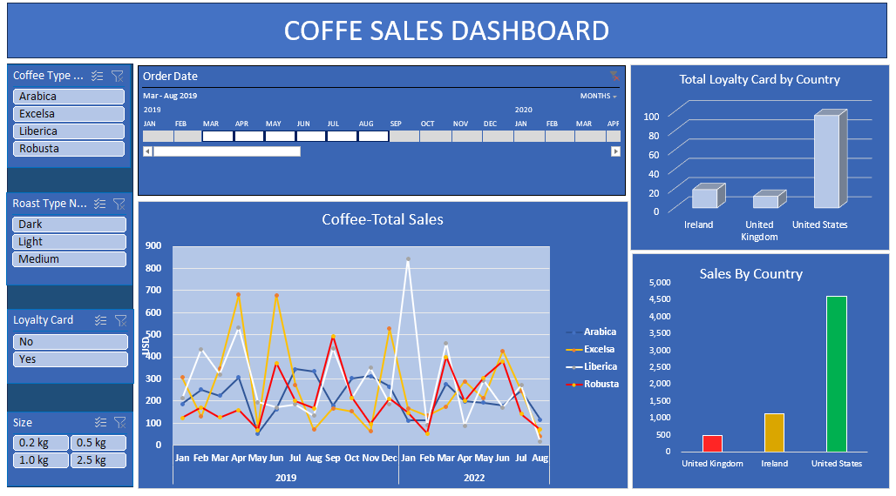

                                       # ☕ Coffee Sales Dashboard   

##  Project Overview  
This **Excel Dashboard** visualizes coffee sales trends, customer insights, and product performance using interactive filters and charts.  

##  Features  
 **Total Sales Over Time** – Track monthly and yearly sales trends using a dynamic line chart.  
 **Sales by Coffee Type & Roast** – Identify the most popular coffee types (Arabica, Robusta, Excelsa, Liberica).  
 **Sales by Country** – Compare coffee sales across different regions.  
 **Loyalty Card Analysis** – See how many customers use loyalty cards by country.  
 **Interactive Filters** – Use slicers to filter data by coffee type, roast level, order date, loyalty status, and package size.  

## 📊 Dashboard Preview  
  

## 🛠 Tools & Technologies  
- **Microsoft Excel** (Pivot Tables, Charts, Slicers)  
- **Power Query** (Data Cleaning & Transformation)  
- **DAX & Measures** (for advanced calculations)  

## 📂 Dataset  
The dataset includes:  
- Order details (Date, Customer, Product, Quantity, Sales)  
- Customer demographics (Country, Loyalty Card usage)  
- Product information (Coffee Type, Roast Type, Pricing)  

## 📥 How to Use  
1. **Download the file**: 
2. Open the attached file in **Microsoft Excel** (2016 or later recommended).  
3. Use **slicers & filters** to explore the data interactively.  

## 📈 Business Insights  
- 📅 **Sales Trends:** Peak sales months & seasonal patterns.  
- 🌍 **Market Analysis:** Highest sales in the **United States**.  
- 🎯 **Customer Loyalty:** Most loyalty card users are in the **U.S.**, but other regions show growth potential.  

## 🌟 Next Steps  
🔹 Convert this dashboard into a **Power BI report** for more advanced insights.  
🔹 Automate data updates using **Power Query** or **Python (Pandas)**.  
🔹 Integrate SQL to extract real-time sales data from a database.  
